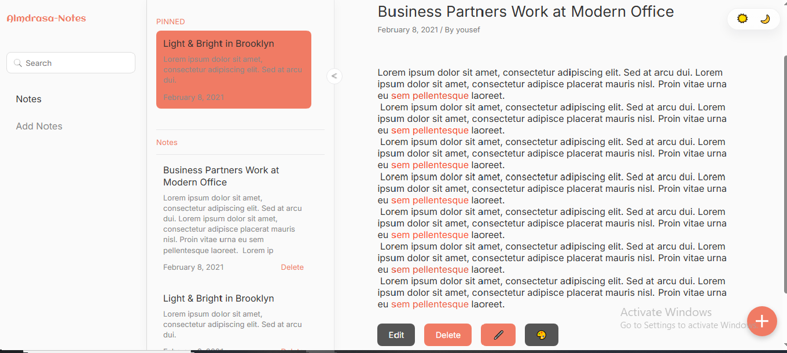
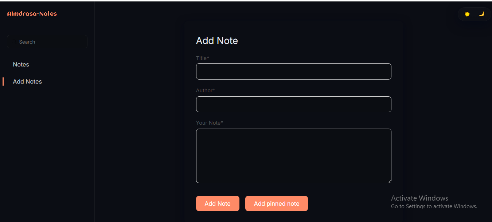

<h1 align="center">🗒️ Almdrasa Notes App</h1>

A beautifully designed and fully interactive <strong>Notes Application</strong> built using <strong>HTML</strong>, <strong>CSS</strong>, and <strong>JavaScript (Modules)</strong>.  
It lets you create, edit, highlight, pin, and delete notes — all stored locally in your browser.  
This project focuses on elegant design, smooth animations, and a delightful user experience. ✨

<h2>📸 Preview</h2>

    
    
  

<h2>🚀 Features</h2>
<ul>
  <li>📝 <strong>Create, Edit, and Delete Notes</strong> with a clean and simple UI</li>
  <li>📌 <strong>Pin Important Notes</strong> – keep your favorites at the top</li>
  <li>🖍️ <strong>Highlight Text & Change Colors</strong> inside your notes</li>
  <li>🌗 <strong>Light / Dark Theme Toggle</strong> with memory using local storage</li>
  <li>💾 <strong>Local Storage Integration</strong> – your notes stay even after closing the app</li>
  <li>📱 <strong>Fully Responsive Design</strong> – optimized for all screen sizes</li>
  <li>🖱️ <strong>Drag & Drop</strong> reordering for pinned and regular notes</li>
  <li>🔍 <strong>Search Functionality</strong> for quick note access</li>
  <li>🎨 <strong>Figma-Inspired Design</strong> – pixel-perfect layout and color palette</li>
  <li>⚙️ <strong>Modular JavaScript Structure</strong> using ES6 modules</li>
</ul>

<h2>🛠️ Tech Stack</h2>
<ul>
  <li>📄 <strong>HTML5</strong> – Semantic and structured markup</li>
  <li>🎨 <strong>CSS3</strong> – Flexbox, Grid, animations, and responsive design</li>
  <li>⚡ <strong>JavaScript (ES6 Modules)</strong> – organized logic and reusable code</li>
  <li>💾 <strong>Local Storage API</strong> – data persistence</li>
  <li>🧭 <strong>Drag & Drop API</strong> – native browser support for reordering</li>
</ul>

<h2>🧪 How to Run</h2>
<ol>
  <li>📥 Clone or download this repository</li>
  <li>📂 Open the project folder in your editor</li>
  <li>🌍 Open <code>index.html</code> in your browser</li>
  <li>✅ Start adding, pinning, highlighting, and managing your notes</li>
</ol>

<h2>💬 Contact</h2>

📧 Email: <a href="mailto:yousseftalaat142@gmail.com">yousseftalaat142@gmail.com</a>

🔗 LinkedIn: <a href="https://www.linkedin.com/in/youssef-talaat-1aa2671b3/">Youssef Talaat</a>

---

<h3 align="center">✨ Created & Maintained by <strong>Youssef Talaat</strong></h3>
